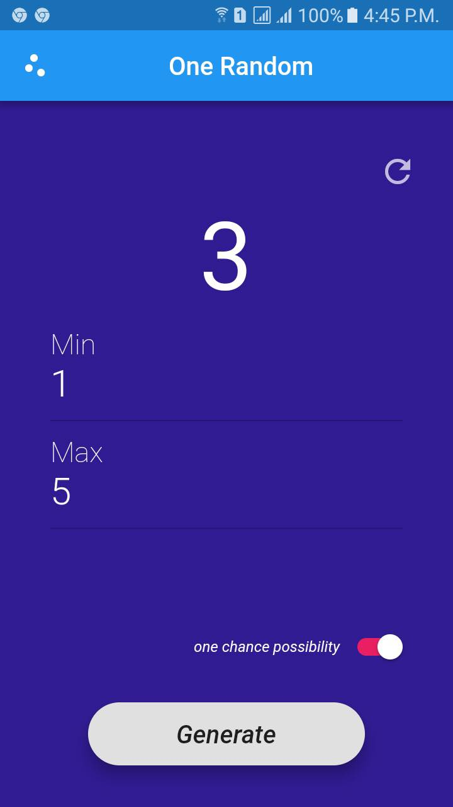

# One Random
------


> One Random is a mobile application that can generate random number by minimum and maximum user input. There are two options which are one chance possibility mode and normal mode (random numbers can be repeatedly). One chance possibility is special feature which means that any random numbers can be released at once. So,you don't need to worry about random numbers generated repeatedly. 

**Note**: This app was initially made for #FlutterCreate, a contest by Google that challenges developers to build a beautiful Flutter app using 5KB or less of Dart code.
Find out more about #FlutterCreate here: https://flutter.dev/create

## Screenshot


## Built With
[Flutter](https://flutter.dev/)

## Packages
* [math](https://api.dartlang.org/stable/2.2.0/dart-math/dart-math-library.html)

## Download & install
First, clone the repository with the 'clone' command, or just download the zip.

```
$ git clone git@github.com:mtstorehub/onechance_random.git
```

Then, download either Android Studio or Visual Studio Code, with their respective [Flutter editor plugins](https://flutter.io/get-started/editor/). For more information about Flutter installation procedure, check the [official install guide](https://flutter.io/get-started/install/).

Install dependencies from pubspec.yaml by running `flutter packages get` from the project root (see [using packages documentation](https://flutter.io/using-packages/#adding-a-package-dependency-to-an-app) for details and how to do this in the editor).

## Developed By
Myat Thu [Github](https://github.com/mtstorehub), [LinkedIn](https://www.linkedin.com/in/myat-thu-47a973128)
[Email](myatthu2018@ucsy.edu.mm)

## License
One Random is released under the MIT License
